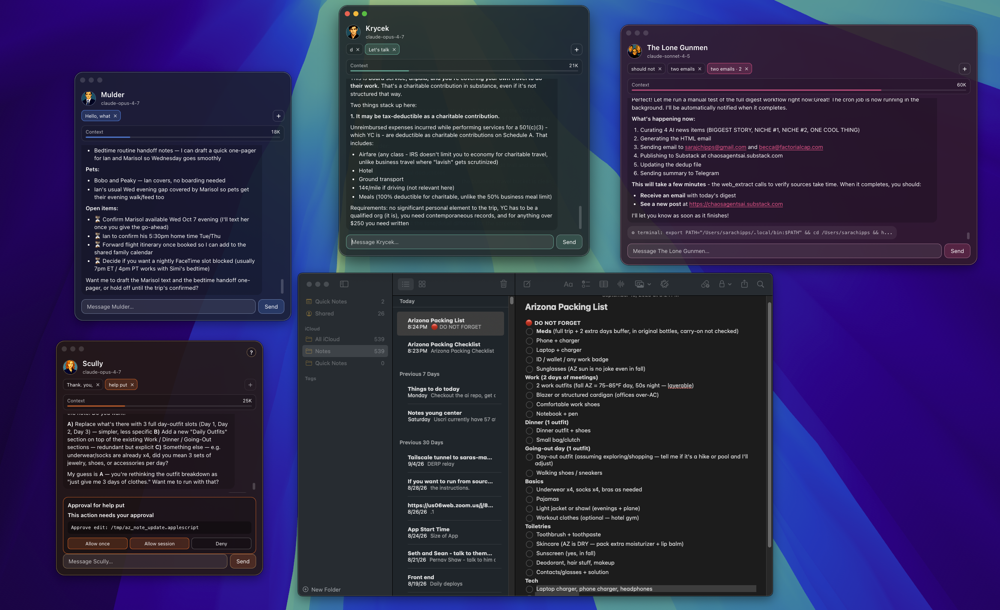
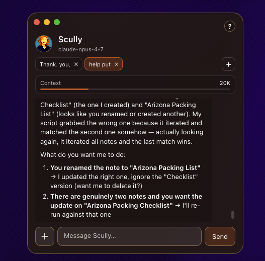

# Circe

**Your agent crew, at home on your desktop.**



Circe brings your [Hermes](https://hermes-agent.nousresearch.com) AI agents onto
your desktop as individual chat windows that live alongside the apps you already
use. Put one agent on trip planning, another on research, and another on everyday
logistics. Keep their conversations in view, switch between tasks while agents
work, and respond to tool approval requests right where they appear.

Give your crew personalities from a favorite fandom, universe, or community,
complete with character names, pixel-art portraits, and individual colors. Bring
your existing Hermes agents or start with a coordinator to help organize your
crew. You choose which agents get tiles and which identities to keep or change.

- **Work alongside your agents.** Keep their tiles beside your notes, browser,
  or editor, with separate conversation tabs for different tasks.
- **Keep long-running work moving.** Switch tabs while an agent is thinking,
  monitor context usage, and start a fresh conversation with a handoff when a
  chat gets too long.
- **See what needs your approval.** Review requested tool actions in the tile
  and allow them once, allow them for the session, or deny them.

Hermes supplies the models, tools, and integrations; Circe gives that crew a
visible home on your desktop. What your agents can do depends on your Hermes
setup.

**[Download the beta for macOS or Windows](https://github.com/SaraJo/circe/releases)**
· Requires Hermes and a connected model provider. Builds are unsigned.

## Running from source

Prerequisites:

- macOS on Apple Silicon, or the experimental Windows 10/11 x64 build
  (see [Windows beta setup](docs/WINDOWS.md))
- Node.js 20 or newer and npm
- Hermes installed and a model provider configured

Clone the repository, install the locked dependencies, and start Electron:

```bash
git clone https://github.com/SaraJo/circe.git
cd circe
npm ci
npm run dev
```

## Install the desktop app

The installers include the Circe app; you do not need to clone this repository
or install Node.js separately to run Circe. Both platforms require Hermes and a
configured model provider before you open the app.

### macOS (Apple Silicon)

1. Install Hermes using its [installation guide](https://hermes-agent.nousresearch.com/docs/getting-started/installation)
   and run `hermes setup` in Terminal to connect a model provider.
2. Open [Circe releases](https://github.com/SaraJo/circe/releases) and download
   `Circe-<version>-arm64.dmg` from the release's **Assets**.
3. Open the disk image and drag **Circe** into **Applications**. Quit an existing
   Circe instance before replacing it with an update.
4. Open **Circe** from Applications. This beta is unsigned and unnotarized. If
   macOS blocks it as an unidentified developer, and you trust the download,
   open **System Settings → Privacy & Security → Open Anyway**, then confirm.
   See [Apple's instructions](https://support.apple.com/en-us/102445).
5. Follow onboarding to choose your agents, their identities, and a coordinator.

The provided Mac installer targets Apple Silicon; an Intel Mac installer is
not currently supplied.

### Windows (Windows 10/11 x64 beta)

1. Install **native Windows Hermes** using its
   [Windows guide](https://hermes-agent.nousresearch.com/docs/user-guide/windows-native).
   Open a new PowerShell window and run `hermes setup` to connect a model provider.
   Circe's Windows build does not use WSL-hosted Hermes profiles.
2. Open [Circe releases](https://github.com/SaraJo/circe/releases) and download
   `Circe-<version>-windows-x64-setup.exe` from **Assets**.
3. Run the installer and choose your installation location. If SmartScreen
   shows an unrecognized-app warning, verify that you downloaded it from this
   repository; for a download you trust, choose **More info → Run anyway** if
   that option is available. The beta is unsigned.
4. Launch **Circe** from the Start menu and follow onboarding.

For custom Hermes paths and Windows-specific limitations, see
[Windows beta setup](docs/WINDOWS.md). For newer builds not yet attached to a
release, download the **Circe-windows-x64** artifact from a successful
[Windows installer workflow](https://github.com/SaraJo/circe/actions/workflows/windows.yml)
(GitHub sign-in required), extract the ZIP, and run the installer inside.

For the authoritative implementation status and near-term roadmap, see
[docs/CURRENT_BUILD.md](docs/CURRENT_BUILD.md). Dated plans and specs are
historical records, not an implementation backlog.

For a small trusted test, use the guided [beta checklist](docs/BETA_TEST.md).

## Tiles up close



Each tile keeps an agent's conversations, context meter, and message composer
within reach. The **＋** beside the message field attaches an image; the **+**
in the tab strip starts a new conversation.

## What it does

1. Checks that [Hermes](https://hermes-agent.nousresearch.com) is installed and
   that a model provider is connected.
2. Detects whether this is a new setup or an existing fleet that has not yet
   made its Circe choices.
3. Existing users choose agents individually for Circe tiles, then accept or
   reject each fandom-based name and colour suggestion independently. Excluded
   agents stay untouched in Hermes, and profile ids never change. Accepted names
   update the agent's Hermes persona and explicit self-introduction. Shown agents
   receive a shared roster of current names and old-name aliases so they can
   refer to each other consistently.
4. New users are asked what fandom, universe, or community they love.
5. Asks your model to pick the coordinator from that world, and three colours
   drawn from them.
6. Writes that character into your Hermes default profile's `SOUL.md`, along with
   a governance persona covering how to grow an agent network without it
   sprawling.
7. Installs the `circe-orchestrator` skill and its Circe operating guide into
   that profile.
8. Opens a tile, themed by the character, with an opening message.
9. Opens tiles for existing profiles and notices new profiles created while it
   is running.

During onboarding, Circe asks Hermes to generate a retro RPG pixel-art portrait
with crossed arms, warm directional lighting, and a rust-to-burgundy background.
Hermes inspects a character image from Wikipedia or Fandom when available and
uses its visual details in the generation prompt; otherwise it uses the character
name, universe, and description. This requires working image generation in Hermes.
The result is cropped and sized to 1024×1536 and saved with its reference URLs and
generated treatment recorded beside it. Generated-image licensing is recorded as
unknown. If generation fails, Circe falls back to the sourced 32×32 avatar or
initials. Existing saved avatars are preserved.

Circe versions its own installed orchestrator resources. On launch it updates
copies that still match what Circe previously installed and leaves customized
copies untouched.

To revisit fleet selection, fandom identities, or coordinator choice, choose
**Circe → Run Onboarding Again…** from the macOS menu bar. Circe backs up its
onboarding record and preserves agents, personas, conversations, and tab history.

When Hermes requests approval for a tool action, Circe shows the command in the
tile and offers allow-once, allow-for-session, or deny. Circe never chooses a
permanent approval option.

Use the **＋** beside a tile's message field to attach one PNG, JPEG, WebP, or
GIF image up to 5 MB. Review the preview, add an optional message, and select
**Send**. Images require a Hermes agent and model that support image input.
Image previews in reopened conversations depend on what Hermes returns during
history replay; some Hermes versions replay only the text.

Circe never wires up an MCP server itself. That is a conversation you have with
your orchestrator, which is what the skill teaches it to do.

## What it does not do

It does not reimplement anything Hermes already does. Installing the runtime,
authenticating providers, creating profiles, and running conversations all go
through the `hermes` binary.

## Development configuration

On macOS, Circe defaults to `~/.local/bin/hermes` and `~/.hermes`.
For Windows defaults and overrides, see [Windows paths](docs/WINDOWS.md#paths).
On macOS, override either location when needed:

```bash
CIRCE_HERMES_BIN=/path/to/hermes HERMES_HOME=/path/to/hermes-home npm run dev
```

Running against the default Hermes home can change profiles when onboarding is
accepted. To exercise onboarding without touching the real Hermes home, point
Circe at a temporary one while continuing to use the installed Hermes binary:

```bash
CIRCE_TEST_HOME="$(mktemp -d)/hermes"
mkdir -p "$CIRCE_TEST_HOME"
HERMES_HOME="$CIRCE_TEST_HOME" npm run dev
```

Stop the development app with Control-C in the terminal that launched it.

## Tests

```bash
npm test
npm run typecheck
```

The tests never touch a real Hermes install. `test/fake/hermes.ts` implements the
same `HermesRuntime` interface the app uses, backed by three scenarios - a machine
with no Hermes, a fresh Hermes install, and an install that already has seven
configured agents. That is how the off-machine cases are covered.

## Building installers

For the Windows beta, run `npm run dist:win`. See [Windows setup and testing](docs/WINDOWS.md).

```bash
npm run dist
```

The application icon is generated from `resources/icon-v4.png`, whose warm,
flat visual style matches the onboarding experience. Earlier concepts remain at
`resources/icon-v2.png`, `resources/icon-v3.png`, and `resources/icon.png` for
comparison.

## Verification status

The automated suite, typecheck, production build, DMG creation, and packaged
onboarding-window launch have been verified. A complete onboarding run on a
clean Mac and a real Hermes permission-card walkthrough remain release checks.
