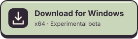
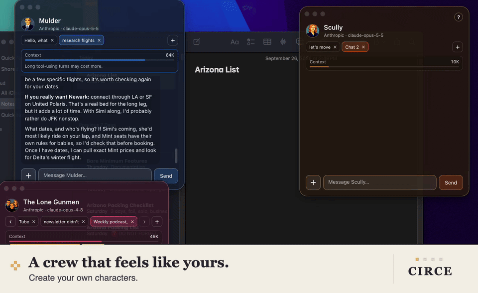
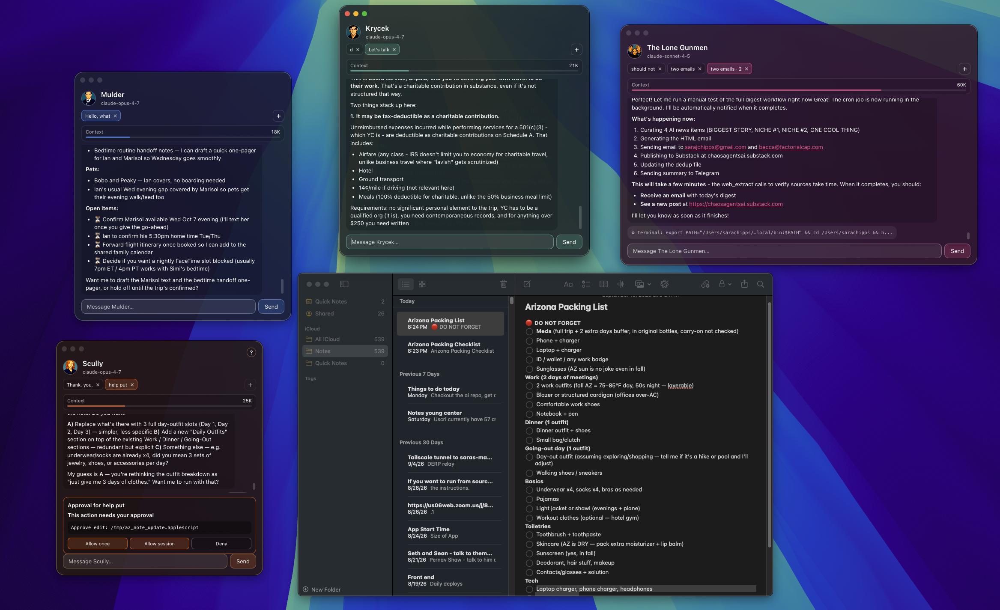
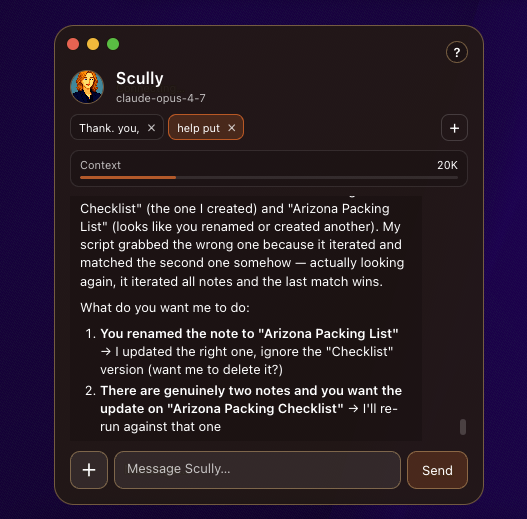

<h1 align="center">
  
</h1>

<p align="center"><strong>Your agent crew, at home on your desktop.</strong></p>

<p align="center">
  <a href="https://github.com/SaraJo/circe/releases"></a>
  <a href="https://github.com/SaraJo/circe/releases/tag/v0.2.12"></a>
</p>

<p align="center">
  <a href="#download">Download</a> ·
  <a href="INSTALL.md">Install guide</a> ·
  <a href="#running-from-source">Run from source</a> ·
  <a href="CHANGELOG.md">Release notes</a> ·
  <a href="docs/README.md">Docs</a> ·
  <a href="CONTRIBUTING.md">Contributing</a>
</p>

<p align="center"><sub>Requires Hermes and a connected model provider. Builds are unsigned.</sub></p>

Circe brings your [Hermes](https://hermes-agent.nousresearch.com) AI agents onto
your desktop as individual chat windows that live alongside the apps you already
use. Give your crew familiar names, pixel-art portraits, and their own colors.
Keep their work in view while you get on with yours.



*Planning a trip with your Circe crew. Edited for length.*
[Watch the video](docs/media/circe-demo.mp4)

## A crew you recognize

Choose a favorite fandom, universe, or community to give your agents their
identities. Bring your existing Hermes agents or start with a coordinator to
help organize your crew. You choose which agents get tiles and which identities
to keep or change.

| | What you can do |
| --- | --- |
| **Keep separate tasks in view** | Put one agent on trip planning, another on research, and another on everyday logistics. Keep their tiles beside your notes, browser, or editor. |
| **Make room for ongoing work** | Use separate conversation tabs, switch tabs while an agent is thinking, and start a fresh conversation with a handoff when a chat gets too long. |
| **Respond where work happens** | Review tool approval requests in the agent's tile. Allow an action once, allow it for the session, or choose **YOLO this task** to approve subsequent actions until the task finishes or you send a new message. |
| **Share what you're looking at** | Attach an image to a conversation when your Hermes agent and model support image input. |

## Your desktop, with company

Keep your agents beside the apps you already use. Each tile gives a conversation
its own space, with a familiar face, task tabs, and tool approvals within reach.





Each tile keeps an agent's conversations, context meter, and message composer
within reach. The **＋** beside the message field attaches an image; the **+**
in the tab strip starts a new conversation.

## Powered by Hermes

Hermes supplies the models, tools, and integrations; Circe gives that crew a
visible home on your desktop. What your agents can do depends on your Hermes
setup. Runtime installation, provider authentication, profile creation, and
conversations all go through the `hermes` binary.

Onboarding can update selected agents' names and personas and install Circe's
orchestrator resources. You choose which identities to accept. See
[onboarding and agent behavior](docs/ONBOARDING.md) for exactly what changes,
how portraits are created, and how to revisit your choices.

## Download

**[Get the Circe beta from GitHub Releases](https://github.com/SaraJo/circe/releases)**

| Platform | Installer |
| --- | --- |
| macOS on Apple Silicon | `Circe-<version>-arm64.dmg` |
| Windows 10/11 x64 (experimental) | `Circe-<version>-windows-x64-setup.exe` |

Both installers are available in [0.2.12 beta](https://github.com/SaraJo/circe/releases/tag/v0.2.12).
See the [release notes](CHANGELOG.md) for changes and platform availability.

Install Hermes and connect a model provider before opening Circe. The beta is
unsigned; macOS builds are also unnotarized. Follow the
[install guide](INSTALL.md) for platform setup and first launch.

## Running from source

Prerequisites:

- macOS on Apple Silicon, or the experimental Windows 10/11 x64 build
  (see [Windows beta setup](docs/WINDOWS.md))
- Node.js 20 or newer and npm
- Hermes installed and a model provider configured

Clone the repository, install the locked dependencies, and start Electron:

```bash
git clone https://github.com/SaraJo/circe.git
cd circe
npm ci
npm run dev
```

## Development configuration

On macOS, Circe defaults to `~/.local/bin/hermes` and `~/.hermes`.
For Windows defaults and overrides, see [Windows paths](docs/WINDOWS.md#paths).
On macOS, override either location when needed:

```bash
CIRCE_HERMES_BIN=/path/to/hermes HERMES_HOME=/path/to/hermes-home npm run dev
```

Running against the default Hermes home can change profiles when onboarding is
accepted. To exercise onboarding without touching the real Hermes home, point
Circe at a temporary one while continuing to use the installed Hermes binary:

```bash
CIRCE_TEST_HOME="$(mktemp -d)/hermes"
mkdir -p "$CIRCE_TEST_HOME"
HERMES_HOME="$CIRCE_TEST_HOME" npm run dev
```

Stop the development app with Control-C in the terminal that launched it.

## Tests

```bash
npm test
npm run typecheck
```

The tests never touch a real Hermes install. `test/fake/hermes.ts` implements the
same `HermesRuntime` interface the app uses, backed by three scenarios - a machine
with no Hermes, a fresh Hermes install, and an install that already has seven
configured agents. That is how the off-machine cases are covered.

## Building installers

For the Windows beta, run `npm run dist:win`. See [Windows setup and testing](docs/WINDOWS.md).

```bash
npm run dist
```

The application icon is generated from `resources/icon-v4.png`, whose warm,
flat visual style matches the onboarding experience. Earlier concepts remain at
`resources/icon-v2.png`, `resources/icon-v3.png`, and `resources/icon.png` for
comparison.

## Verification status

The automated suite, typecheck, production build, DMG creation, and packaged
onboarding-window launch have been verified. A complete onboarding run on a
clean Mac and a real Hermes permission-card walkthrough remain release checks.
